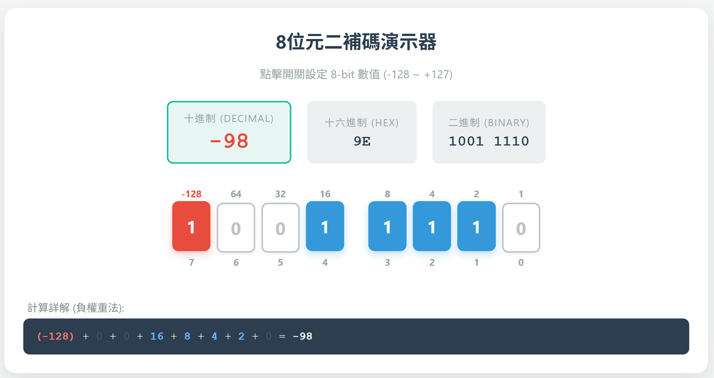

# 8位元二補碼演示器 (8-bit Two's Complement Visualizer)

這是一個簡單、直觀的互動式網頁工具，旨在幫助學生和開發者理解 **8位元二補碼 (8-bit Two's Complement)** 的運作原理。

這個演示器採用 **「負權重法 (Negative Weight)」** 的視覺化邏輯，讓使用者能即時看到二進制位元如何轉化為十進制正負整數。

## ✨ 主要功能

* **8-bit 完整範圍演示**：支援從 `-128` 到 `+127` 的所有數值。
* **即時數值轉換**：同步顯示 **十進制 (Decimal)**、**簡潔十六進制 (Hex)** (如 `FF`, `80`) 以及 **二進制 (Binary)**。
* **互動式開關**：點擊位元按鈕 (0/1) 即可改變狀態，支援高低位元組 (Nibble) 視覺分組。
* **計算詳解欄**：動態顯示計算過程（例如：`-128 + 0 + 32 + ... = -96`），讓數學邏輯一目瞭然。
* **單一檔案設計**：所有程式碼 (HTML/CSS/JS) 整合在一個 `.html` 檔案中，無需安裝，隨點隨用。

## 🚀 如何使用 (Quick Start)

1.  **下載**：Clone 此專案或下載 `index.html` 檔案。
2.  **開啟**：使用任何現代網頁瀏覽器（Chrome, Edge, Firefox, Safari）直接開啟該檔案。
3.  **操作**：
    * 點擊 **紅色按鈕 (Bit 7)** 來控制符號位元 (-128)。
    * 點擊 **藍色按鈕 (Bit 0-6)** 來增加正數值。

## 🧮 核心概念：負權重法

二補碼最容易的理解方式是將最高有效位元 (MSB) 視為 **負權重**，其餘位元視為 **正權重**。

| 位元位置 (Bit Index) | 7 (MSB) | 6 | 5 | 4 | 3 | 2 | 1 | 0 (LSB) |
| :--- | :---: | :---: | :---: | :---: | :---: | :---: | :---: | :---: |
| **權重 (Weight)** | **-128** | 64 | 32 | 16 | 8 | 4 | 2 | 1 |

### 演示範例

* **最小值 (-128)**: 只打開 Bit 7。
    * `1000 0000` = **-128** (Hex: `80`)
* **最大正整數 (+127)**: 關閉 Bit 7，打開 Bit 0-6。
    * `0111 1111` = 0 + 64 + 32 + 16 + 8 + 4 + 2 + 1 = **127** (Hex: `7F`)
* **-1 的由來**: 全部打開。
    * `1111 1111` = -128 + (127) = **-1** (Hex: `FF`)

## 🛠️ 技術細節

* **語言**: HTML5, CSS3, Vanilla JavaScript (ES6)
* **依賴**: 無 (Zero dependencies)
* **相容性**: 支援所有現代桌面與行動裝置瀏覽器。

## 📝 授權 (License)

此專案為開源專案，歡迎自由修改用於教學或個人學習用途。

👩‍💻 Maintainer： [lct1995chaewon](https://github.com/lct1995chaewon)
