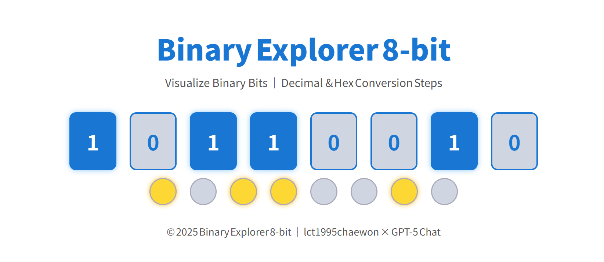

# 💡 Binary Explorer 8‑bit  

> 一個可視化的八位元二進教具，點擊位元即可即時顯示  
> 對應的十進值、十六進值，以及詳細步驟（列式展開）。

---

## 🌐 Demo  
🔗 https://lct1995chaewon.github.io/Binary-Explorer-8-bit/
---

## 🧩 介紹
**Binary Explorer 8‑bit** 是用於學習與演示「位元概念」的互動網頁。  
使用者可沿着一組 8 位元按鈕自由切換 0 與 1，  
並在下方即時查看：  
- 十進制 (Decimal)  
- 十六進制 (Hexadecimal)  
- 位權展開過程（列式步驟）  

整體設計採用淺系藍白介面，操作簡潔直覺，適合數位邏輯課堂、實驗室示範或遠端教學。

---

## 🎯 主要功能

| 功能 | 說明 |
|:--|:--|
| 🎚️ 位元切換 | 上方八個 bit 可以獨立點擊 (0/1 互轉) |
| 💡 燈號反映 | 每個 bit 下方的燈泡同步亮起或熄滅 |
| 🧮 即時計算 | 自動計算十進與十六進結果 |
| 📘 列式展示 | 詳細顯示 2ⁿ 位權展開與加總過程 |
| 📱 響應式設計 | 電腦與手機介面皆可順利操作 |
| 🎨 可印講義 | 簡潔風格，適用課堂教材或講義輸出 |

---

## 🧠 範例
| 動作 | 結果 |
|:--|:--|
| 你點選高位 bit `1`、低位 bit `1` | 上方顯示二進：`10000001` |
| 計步列式顯示 | `1×2⁷ + 0×2⁶ + … + 1×2⁰ = 128 + 1 = 129` |
| 十進結果 | `129` |
| 十六進結果 | `81` |

---

## 📘 使用方式

1️⃣ 開啟 [Demo 頁面](https://lct1995chaewon.github.io/binary-explorer-8bit/)。  
2️⃣ 點擊上方任意位元卡切換 0 或 1。  
3️⃣ 觀察：
   - 燈號亮起/熄滅  
   - 下方即時顯示十進與十六進結果  
   - 「步驟 Steps」區出現完整展開過程。  

---

## 🧰 技術說明

| 分類 | 技術 |
|:--|:--|
| 前端框架 | 無（純 HTML 5 + CSS 3 + Vanilla JavaScript） |
| 排版系統 | Flexbox 布局，橫向對齊上下兩層 |
| 特性 | 全前端運作，不需伺服器與資料庫 |
| 相容瀏覽器 | Chrome / Edge / Firefox / Safari |

---

## 🔗 相關連結

| 專案 | 內容 |
|:--|:--|
| [Base Convert Lab DLS](https://lct1995chaewon.github.io/base-convert-lab-dls/) | 十進 ↔ 二進 ↔ 十六進互轉與步驟演示 |
| Binary Explorer 8‑bit | 八位元可視化及位權展開示範 |

---

## 📝 授權 License
本專案採用 [MIT License](https://opensource.org/licenses/MIT) 授權。  
可自由使用、修改及散布，但請保留作者署名。

---

## 💬 English Summary
**Binary Explorer 8‑bit** — an interactive visualization for  
understanding binary digits and place values.  
Users can toggle each of the 8 bits and instantly observe  
decimal / hexadecimal conversions with detailed computational steps.  

**Highlights**
- Real‑time updates  
- Step‑by‑step expansion of 2ⁿ values  
- Responsive layout and clean light theme  

---

👩‍💻 Maintainer： [lct1995chaewon](https://github.com/lct1995chaewon)
